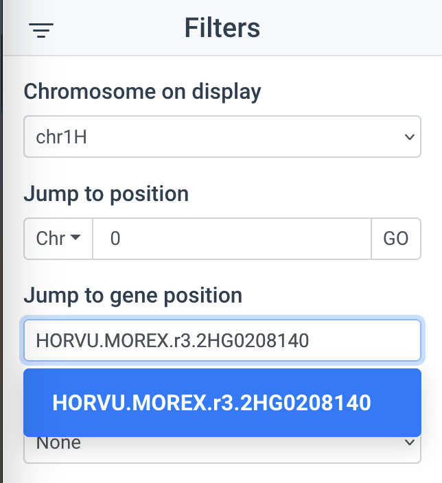
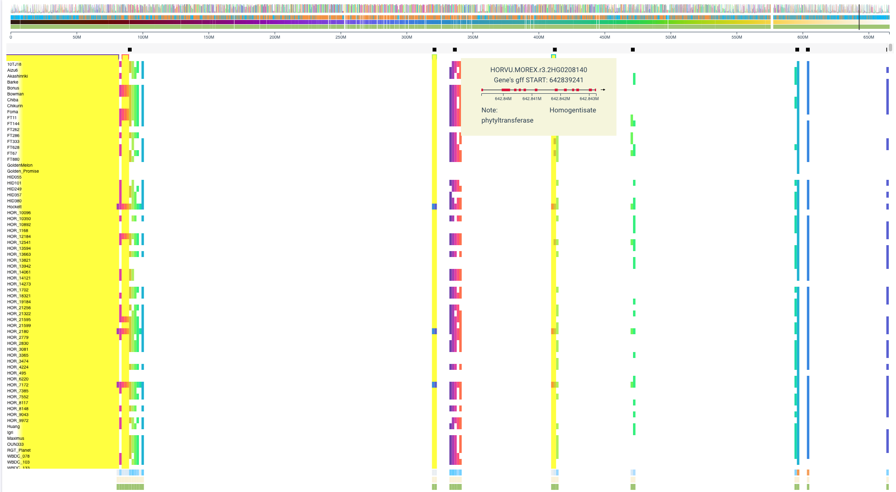
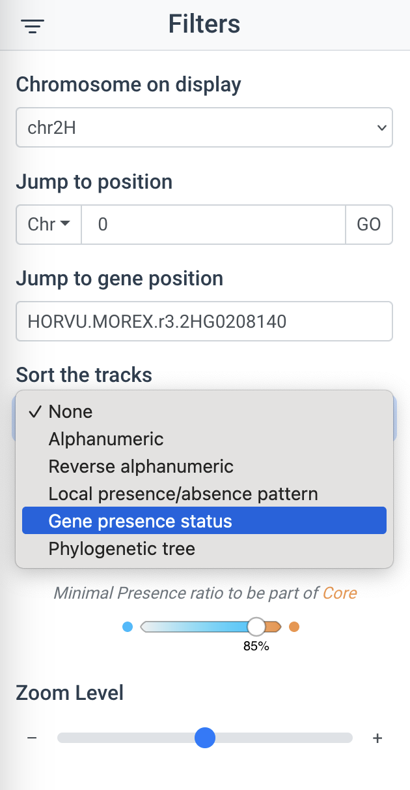
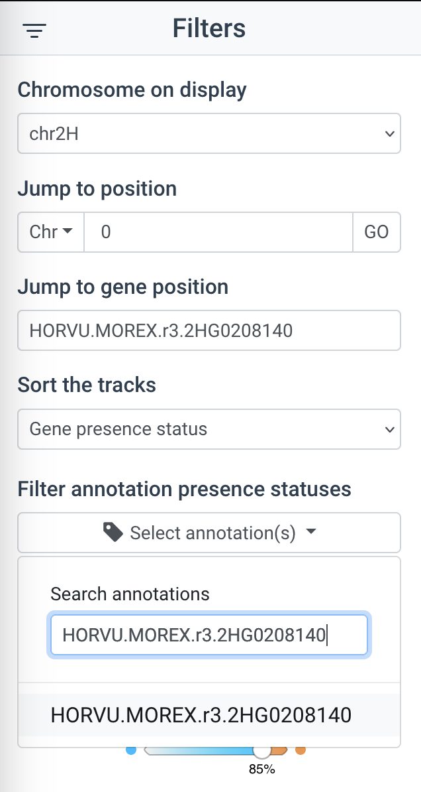
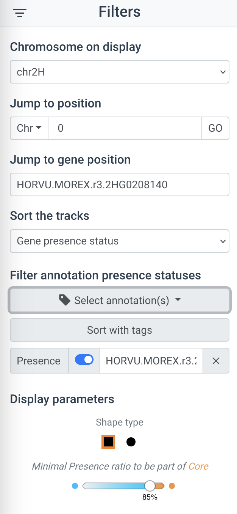
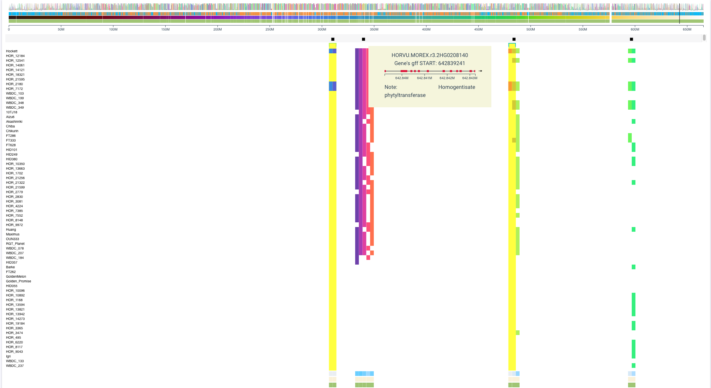
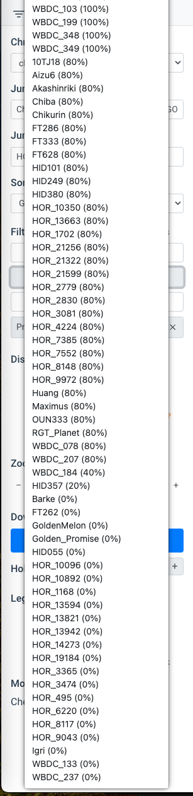

# I. Barley panache browser tutorials

### 1. The barley panache browser can be accessed using the following link

http://www.barleypangenome.com/barley_panache_v2/

### 2. Additional documentation on Panache can be found here  

#### Wiki home: https://github.com/SouthGreenPlatform/panache/wiki

#### Functionality: https://github.com/SouthGreenPlatform/panache/wiki/Functionalities-tour

#### PAV Sorting: https://github.com/SouthGreenPlatform/panache/wiki/Sorting-options

### 3. Example use case to identify PAV of the HPT2 gene:

#### a)	Open Barley Panache and wait for the tracks to load in (can take a while depending on server load and data size).

#### b)	From the menu go to ‘Jump to gene position’ and load up the HPT2 gene (HORVU.MOREX.r3.2HG0208140):

#### c)	Locate the HPT2 gene. 

#### d)	From the menu select ‘gene presence status’. Note: if selecting ‘Phylogenetic tree’ the genomes are sorted based on the phylogenetic tree, as determined by mashtree (mash distance).

#### e)	Put the HTP2 gene ID into the annotation search (multiple genes can be added).

#### f)	From the menu select ‘Sort with tags’

#### g)	The genomes are now sorted by the HPT2 gene’s presence/absence status

#### h)	The percentage of presence/absence of HPT2 across each genome is calculated and displayed

