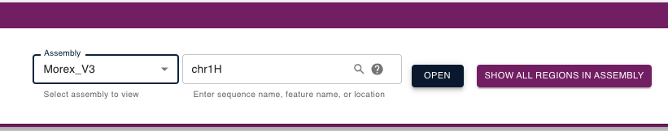
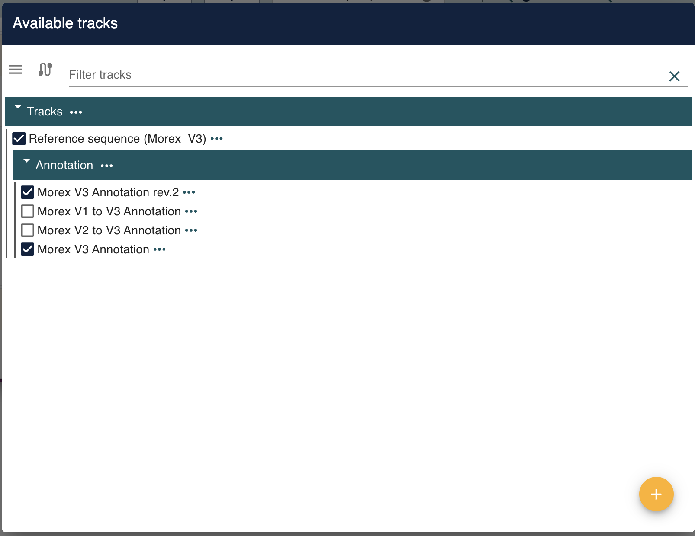
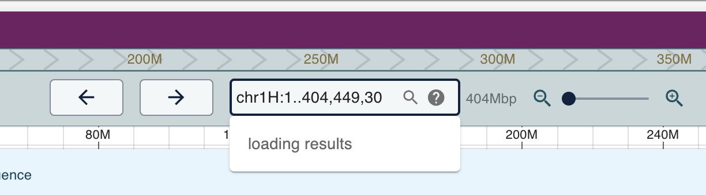

# I. Barley genome browser tutorials

### 1. The genome browsers can be accessed using the following link

http://database.barleypangenome.com/barley76/

### 2. First, select the genome from the dropdown list  

### 3. Select the chromosome you'd like to view then "Open"

### 4. Select the tracks using the "Open track selector" button

*Note: included are tracks for converting from different annotation versions (e.g. Morex v1 and v2 to v3)* 

### 5. You can manually input the region you want to search

*Using the chr1H:123..456 format*    

**Or search using Gene ID (need to make functional and update) **

**Select the region manually and zoom in**

### 6. Obtain gene sequences  

**Gene sequences can be obtained by clicking in the gene annotation**  

**Then select the type of sequence you want to get, then hit "Copy as plaintext"**  

### 7. Reference genome bases view  

**Individual base-pair can be view by zooming in the reference tracks**  

### 8. Genetic variants view  

**Genetic variants, including SNP and Indel, can be view by clicking on the variant positions**

To be added in later

