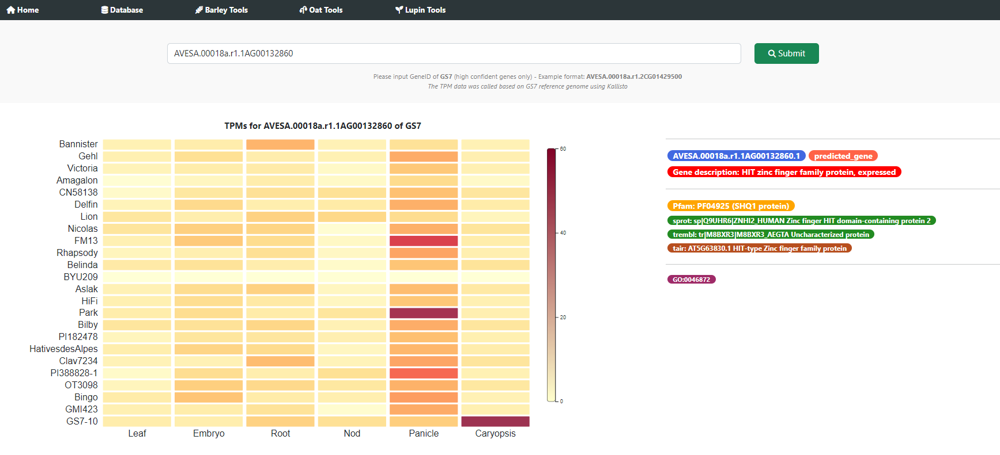
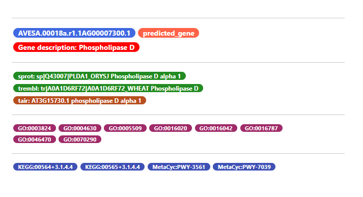
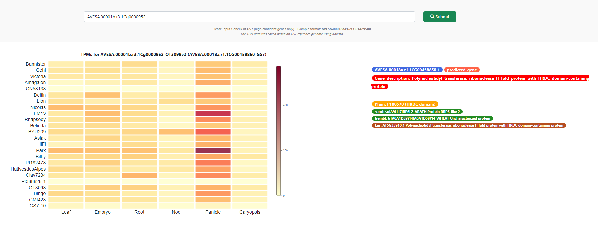

# III. Oat pan-transciptome database tutorials

### 1. The Oat pan-transciptome database can be accessed using the following link

http://database.oatpangenome.com/oat_transcriptome/

**If navigating from the home page, it can be accessed through Oat Tools > Pan Transciptome** 

### 2. First, input the GS7 gene ID to the search bar  

### 3. The result include heatmap of gene expression, gene annotations and extra Information

**Pfam domain, GO and KEGG annotations are also included if available**

### 4. Gene ID of OT3097v2 can also be used

**However, only ~50.000 high confident genes of OT3098v2 can be mapped at the moment**

**Please use the genome browser to convert gene IDs if your gene could not be found**

**Matching gene ID of GS7 will also be shown, including extra information**

