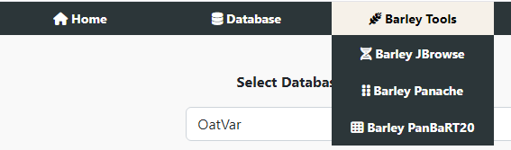
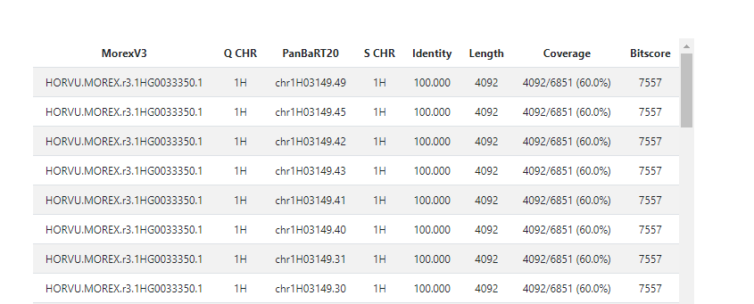
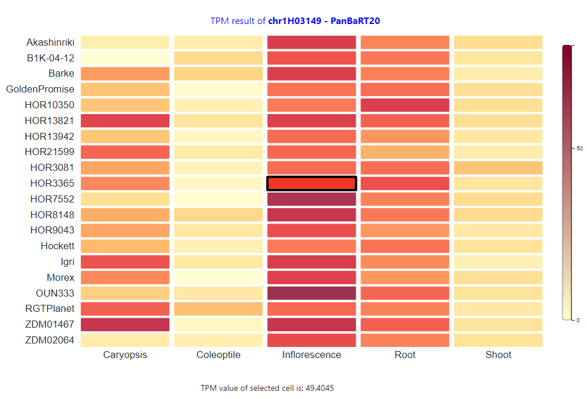

# Barley pan transcriptome tutorials

### 1. The Barley pan transcriptome browsers can be accessed using the following link

http://database.barleypangenome.com/barley_panbart20/

Alternatively, the Barley pan transcriptome browsers can be accessed using the dropdown list under Barley Tools > Barley PanBART20

For detailed information about the data tracks available on the Barley pan transcriptome browsers, please refer to the [database introduction section](../Barley.md#5-barley-linear-pan-transcriptome-database)

### 2. The gene expression data can be searched using Morex V3 gene IDs  

### 3. Currently, geneID matching is obtained using BLAST

*HORVU.MOREX.r3.1HG003335 can be confidently matched with chr1H03149*

*Low coverage result may be caused by the non-coding sequences in the PanBaRT20, this will be resolved in the future database*

### 3. Heatmap is used to show differences in gene express of the query gene

**TPM value can be seen by hovering the mouse above the cells**

