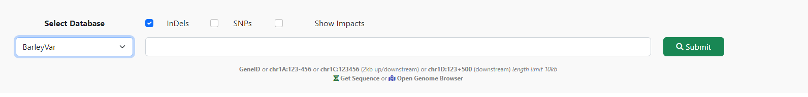
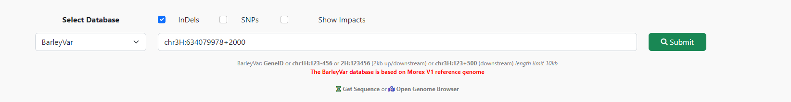
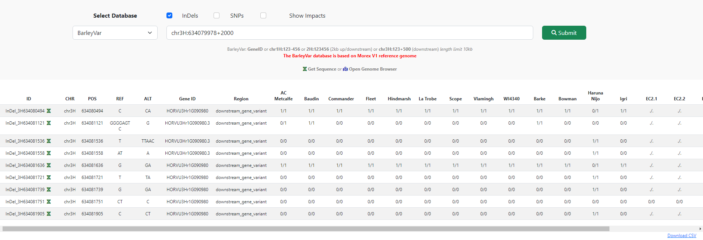
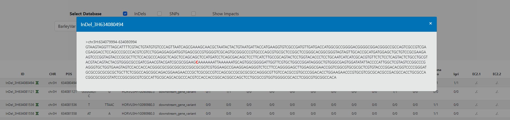
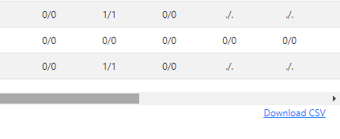
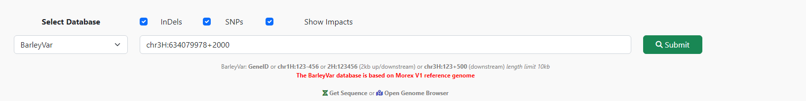
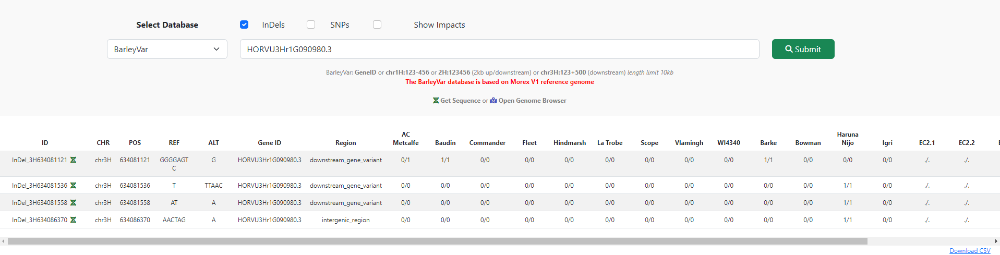
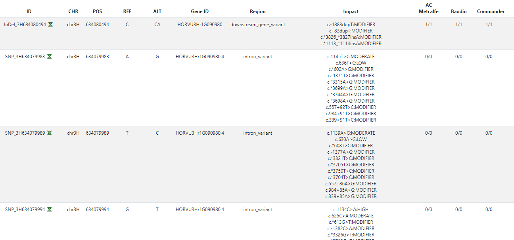

# Barley variant database tutorials

### 1. The variant database can be accessed using the following link

http://database.barleypangenome.com/search/

Or click on Database on the navigation bar on top of the website

**Select Barleyvar from the database list**

### 2. Query by physical positions

**For physical position query, different format can be used**

* Chromosome:start-end (chr1H:123-456)  
* Chromosome:position to query 2kb up and downstream (chr1H:123456)  
* Chromosome:start+length to query an exact region from start position (chr1H:123+500)  

### 3. The result is display in a table format

### 4. The sequence around the variant can be retrieve using the sequence icon next to the variant ID

*The sequence is pre-formated in fasta format and the variant is in red*  

### 5. The whole result table can be exported into csv format

## 6. SNPs and annotations

**By default, only Indels is pre-selected. SNPs and variant annotations data can be enable using the check boxes**

## 7. Query by geneIDs

**All variants within the gene regions can be query using gene IDs**

*The example gene ID format is HORVU3Hr1G090980*  

## 8. Distinguish SNPs and Indels from the result

**Indels and SNPs (if enable) can be distinguish using their variants ID on the left column**

