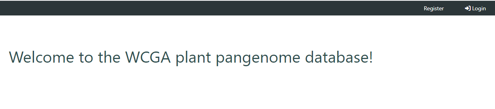
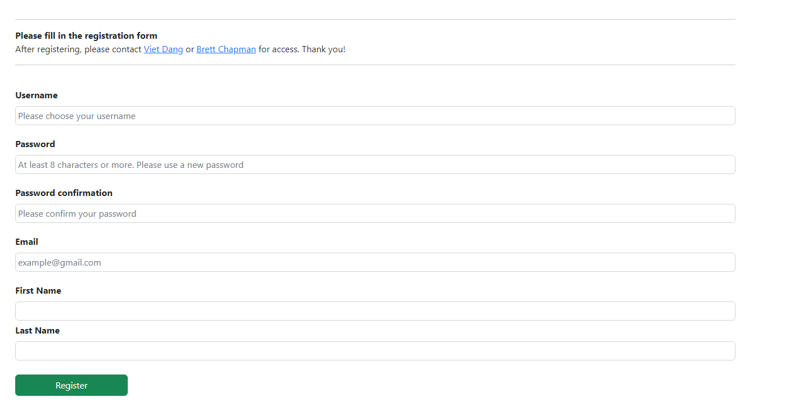

# I. Registration process

To start using the database, you'll need to create an account with your name and email address.

### 1. Registration form  

The registration form can be located at the right corner of the website.

Alternatively, you can access the registration form using this [direct link](http://database.barleypangenome.com/register/)

Please fill the form with your information and finish by click register.  

After finish registering, you can try logging in using your registered username and password.  

### 2. Data access

After the registration process, please send an email with your user name to [our team](mailto:viet.dang@murdoch.edu.au) to get access to the tools and data.  
However, some of the unpublished data are only accessible to our close collaborators.  
